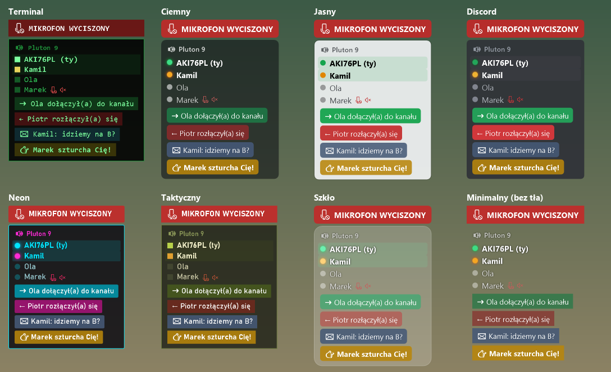

# TS6 Overlay

Nakładka na grę dla **TeamSpeak 6**: pokazuje, kto jest na Twoim kanale i kto mówi, a także kto wchodzi, kto wychodzi, wiadomości i szturchnięcia. Ostrzega też, gdy mówisz do wyciszonego mikrofonu.



## Instalacja

1. Pobierz `TS6Overlay.exe` ze strony [Releases](https://github.com/aki76pl/ts6-overlay/releases/latest).
2. Uruchom plik i kliknij **Tak**, gdy program zaproponuje instalację. Instalacja nie wymaga uprawnień administratora. Program trafia do `%LOCALAPPDATA%\Programs\TS6Overlay`, dostaje skrót w menu Start i uruchamia się razem z Windows.
3. W TeamSpeaku kliknij **Zezwól**, gdy pojawi się prośba o dostęp dla „TS6 Overlay”. Jeśli prośba się nie pojawi, sprawdź w TS **Ustawienia → Remote Apps**, czy API jest włączone.

Program sam sprawdza aktualizacje i instaluje je jednym kliknięciem. Odinstalujesz go w **Ustawieniach Windows → Aplikacje**.

## Funkcje

| | |
|---|---|
| **Kto mówi** | lista osób na kanale; mówiący ma podświetlony wiersz i świecący znacznik, szept ma inny kolor |
| **Wejścia i wyjścia** | powiadomienie i sygnał, gdy ktoś wchodzi na kanał lub go opuszcza |
| **Bindy (soundboard)** | własne skróty klawiszowe (np. F9, Ctrl+1, Num 5), które odtwarzają wybrany dźwięk, również w grze; dźwięk może iść na osobne urządzenie, np. wirtualny kabel |
| **Własne dźwięki** | do każdego zdarzenia przypiszesz swój plik `.wav` lub `.mp3` (przycisk albo przeciągnij i upuść) |
| **Wiadomości i szturchnięcia** | prywatne, z kanału i z serwera (każdy rodzaj włączasz osobno); szturchnięcie trzęsie powiadomieniem |
| **Mikrofon wyciszony** | czerwony pasek, gdy masz wyciszony mikrofon lub głośniki; gdy mówisz do wyciszonego mikrofonu, pasek miga i słychać sygnał |
| **Autoukrywanie** | gdy nikt nie mówi, nakładka blednie albo zostaje sam nagłówek; wraca od razu, gdy coś się dzieje |
| **Tylko w grach** | nakładka widoczna tylko wtedy, gdy gra z listy (albo dowolna aplikacja pełnoekranowa) jest na pierwszym planie |
| **Ulubieni i ignorowani** | ulubieni mają własny kolor nicku i dźwięk wejścia; ignorowani (np. boty muzyczne) znikają z nakładki |
| **Motywy** | 8 wbudowanych motywów (domyślny Terminal) i edytor do tworzenia własnych; motywy wymieniasz ze znajomymi w plikach `.ts6theme` |
| **OBS** | ta sama nakładka jako strona `http://localhost:5898/` dla źródła „Przeglądarka”; działa też w grach pełnoekranowych |
| **Statystyki** | bieżąca sesja oraz historia dni, tygodni i miesięcy: kto ile był na serwerze i mówił, z wykresami; eksport do CSV |
| **Archiwum czatu** | wiadomości i szturchnięcia zapisywane z datą, z wyszukiwarką |
| **Panel na telefonie** | strona w sieci domowej (kod QR): lista osób, ostatnie wiadomości, przyciski bindów, „zatrzymaj wszystko” |
| **Podświetlenie RGB** | błysk klawiatury lub myszy kolorem przy szturchnięciu, wejściu znajomego i innych zdarzeniach (przez OpenRGB; po błysku podświetlenie wraca do Twoich ustawień) |
| **Status w Discordzie** | „Na TeamSpeaku: Pluton 6 · 3 osób na kanale” z licznikiem czasu w Twoim profilu Discord |
| **Lektor** | czyta powiadomienia na głos (wejścia, wiadomości, szturchnięcia, znajomi); słychać go także w grach z wyłącznym pełnym ekranem |
| **Klawisze podglądu** | przytrzymaj klawisz: pełna lista osób na serwerze albo ostatnie 10 wiadomości; po puszczeniu wszystko wraca |
| **Profile gier** | osobna pozycja, rozmiar, przezroczystość i motyw dla każdej gry; program przełącza je sam |
| **Znajomy online** | powiadomienie, gdy ulubiony wchodzi na serwer (opcjonalnie też, gdy wychodzi) |
| **Obserwowane kanały** | mała lista osób z wybranych kanałów (np. „Lobby”) pod Twoim kanałem, z opcjonalnym powiadomieniem |
| **Kilka serwerów** | gdy TeamSpeak jest połączony z kilkoma serwerami, nakładka pokazuje je wszystkie |
| **Kopia ustawień** | eksport i import wszystkiego (motywy, dźwięki, bindy, ulubieni, profile) w jednym pliku `.ts6backup` |
| **English** | interfejs po polsku lub angielsku (domyślnie według języka Windows) |
| **Nazwy kanałów** | usuwa znaczniki `[spacer]` i ozdobniki, np. `[spacer]╟-● Pluton 9` → `Pluton 9` |

## Obsługa

- **Ctrl + lewy przycisk myszy** na nakładce: przesuwanie.
- **Ctrl+Shift+O**: pokaż lub ukryj nakładkę.
- **Ikona w zasobniku**: dwuklik otwiera ustawienia, prawy przycisk otwiera szybkie menu (motyw, dźwięki, tryby, statystyki).
- Ponowne uruchomienie programu, np. ze skrótu w menu Start, otwiera ustawienia.

### Lektor i klawisze podglądu

Lektora włączysz w **Ustawieniach → Powiadomienia**: wybierasz, co ma czytać, głos (np. Paulina albo Zira), tempo i głośność. Opcja „Czytaj tylko, gdy gra jest na pierwszym planie” wycisza go poza grami.

Klawisze podglądu ustawisz w **Ustawieniach → Bindy**. Trzeba je **przytrzymać**: nakładka pokazuje wtedy cały serwer albo ostatnie wiadomości, nawet jeśli była ukryta.

### Profile gier

W **Ustawieniach → Zachowanie → Profile gier** wybierz grę i kliknij **+ Dodaj profil**. Gdy gra jest na pierwszym planie, nakładka przyjmuje pozycję, rozmiar, przezroczystość i motyw z profilu. Przesunięcie nakładki (Ctrl + mysz) w trakcie gry zapisuje pozycję w profilu tej gry.

### Własne dźwięki

W **Ustawieniach → Powiadomienia** każde zdarzenie (wejście, wyjście, wiadomość, szturchnięcie, wejście ulubionego, mówienie do wyciszonego mikrofonu) ma przycisk **Wybierz…**. Plik możesz też przeciągnąć na wiersz zdarzenia. Program przyjmuje formaty `.wav`, `.mp3`, `.wma`, `.aiff` i `.m4a`, kopiuje plik do `%APPDATA%\TS6Overlay\sounds` i odtwarza najwyżej 8 sekund. Przycisk **Wbudowany** przywraca domyślny sygnał. Każdy ulubiony może mieć własny dźwięk wejścia, który ustawiasz w zakładce **Osoby**.

### Bindy

W **Ustawieniach → Bindy** kliknij **+ Dodaj bind**, potem przycisk skrótu, i naciśnij klawisz albo kombinację (Esc anuluje, Backspace usuwa). Dźwięk wybierasz przyciskiem albo przeciągasz plik na wiersz binda. Ponowne naciśnięcie skrótu w trakcie odtwarzania zatrzymuje dźwięk. Możesz też ustawić osobny **klawisz „zatrzymaj wszystko”**, który ucina każdy grający dźwięk (bindy i powiadomienia). Bindy są też w menu ikony w zasobniku.

Domyślnie dźwięki bindów słyszysz tylko Ty. Żeby słyszeli je inni na TeamSpeaku, zainstaluj wirtualny kabel audio (np. VB-Audio Virtual Cable), wybierz go w polu **Urządzenie** i podaj do TS razem z mikrofonem (np. przez VoiceMeeter).

### Panel na telefonie

W **Ustawieniach → Telefon i Discord** zaznacz „Włącz panel na telefonie” i zeskanuj kod QR aparatem telefonu (telefon musi być w tej samej sieci Wi-Fi). Windows zapyta o dostęp do sieci: zaznacz „Sieci prywatne” i kliknij „Zezwól”. Adres zawiera tajny klucz, więc nikt inny w sieci nie odpali Twoich dźwięków. W razie potrzeby wygenerujesz nowy klucz przyciskiem.

### Status w Discordzie

Discord wymaga identyfikatora aplikacji (Application ID). Utwórz go raz na [discord.com/developers/applications](https://discord.com/developers/applications): **New Application**, nazwa np. „TeamSpeak”, potem skopiuj **Application ID** do ustawień. Status działa, gdy na komputerze jest uruchomiona aplikacja Discord.

### Podświetlenie RGB

Wymaga darmowego programu [OpenRGB](https://openrgb.org) z włączonym serwerem SDK: karta **SDK Server → Start Server**. Potem w **Ustawieniach → Integracje** zaznacz „Włącz błyski RGB” i wybierz zdarzenia oraz kolory. Przed błyskiem program zapisuje bieżące podświetlenie jako profil OpenRGB `TS6Overlay-restore`, a po błysku je przywraca.

### OBS

W ustawieniach w zakładce **OBS** włącz stronę, a potem w OBS dodaj źródło **Przeglądarka** z adresem `http://localhost:5898/` (szerokość 500, wysokość 600). Do adresu możesz dopisać parametry:

- `?only=talking`: tylko osoby, które mówią,
- `?scale=1.5`: powiększenie,
- `?notices=0`: bez powiadomień.

## Ograniczenia

- Okienko nakładki na ekranie widać, gdy gra działa w trybie **okno bez ramek** (Borderless). W wyłącznym pełnym ekranie gra je zasłania. Wtedy zostaje nakładka w OBS.
- Program korzysta z lokalnego API TeamSpeaka (Remote Apps, `ws://127.0.0.1:5899`). Może czytać, co się dzieje, ale nie może np. przenosić ani wyciszać innych osób.
- Wykrywanie mowy przy wyciszonym mikrofonie nasłuchuje domyślnego mikrofonu **tylko wtedy, gdy jest on wyciszony w TS**. Program bada jedynie poziom głośności i nigdzie nie zapisuje dźwięku.

## Budowanie

Wymagany .NET 10 SDK.

```
dotnet build -c Release
dotnet publish -c Release -r win-x64 --self-contained true -p:PublishSingleFile=true -p:IncludeNativeLibrariesForSelfExtract=true -p:EnableCompressionInSingleFile=true -o publish
```

Plik `publish\TS6Overlay.exe` działa bez instalowania .NET.

## Autor i licencja

Autor: **AKI76PL**

© 2026 AKI76PL. Program jest udostępniony na licencji MIT (szczegóły w pliku [LICENSE](LICENSE)).
